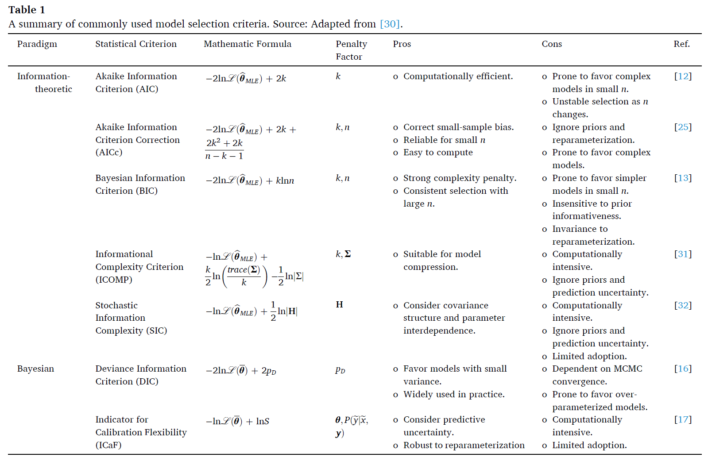

---

##### Download

+ [Paper](https://doi.org/10.1016/j.ins.2025.122743)
+ [Code and data](https://github.com/Lesliexxy)

---

##### Abstract

Reliable model selection is a cornerstone of developing physics-based models of engineering systems. However, existing model selection criteria has not been investigated across a variety of calibration scenarios, where selection choices can be affected by (i) parameter dimensionality, (ii) model form, (iii) prior informativeness, (iv) reparameterization, and (v) data characteristics. Moreover, it remains unclear whether these criteria can reliably distinguish model fidelity that genuinely improves explanatory power. These limitations restrict the broader applicability of model selection criteria in physics-based modeling, where balancing goodness-of-fit, complexity, and generalization is critical. To address these gaps, this study systematically evaluates information-theoretic and Bayesian model selection criteria through two case studies. The first case study employs polynomial regression models to isolate the effects of calibration factors and investigate their influence on the selection behavior of criteria. The second case study extends the analysis to a hierarchy of thermal models for double-pane windows, examining the ability of selection criteria to differentiate effective complexity from superficial increases in model fidelity. Results indicate that classical information-theoretic criteria are sensitive to parameter dimensionality, while covariance-based criteria reflect changes in model form and data characteristics, and Bayesian criteria exhibit sensitivity to all examined calibration factors. Furthermore, both covariance-based and Bayesian criteria effectively identify secondary physical mechanisms as sources of ineffective complexity, penalizing redundant fidelity. These findings underscore that model selection is not a one-size-fits-all task, and the choice of model selection criteria should be informed by the calibration scenario and the modeling objective.

---

##### Figure 1: Schematic diagram of bias-variance trade-off and model complexity. (a) underfitted model, (b) well-fitted model, and (c) overfitted model.


---

##### Table 1: A summary of commonly used model selection criteria.



---

##### Citation

X. Xu, J.Wang. Information-theoretic and Bayesian Model Selection for Physics-based Model Calibration: Balancing Fit, Complexity, and Generalization. Information Sciences, Volume 726, 2026, 122743, ISSN 0020-0255, https://doi.org/10.1016/j.ins.2025.122743, (Impact factor: 6.8)

```BibTeX
@article{XU2026122743,
title = {Information-theoretic and Bayesian model selection for physics-based modeling: Balancing fit, complexity, and generalization},
journal = {Information Sciences},
volume = {726},
pages = {122743},
year = {2026},
issn = {0020-0255},
doi = {https://doi.org/10.1016/j.ins.2025.122743},
url = {https://www.sciencedirect.com/science/article/pii/S0020025525008795}}
```

---

##### Related material

+ [Presentation slides](presentation1.pdf)
+ [Summary of the paper](https://www.penguinrandomhouse.com/books/110403/unusual-uses-for-olive-oil-by-alexander-mccall-smith/)
